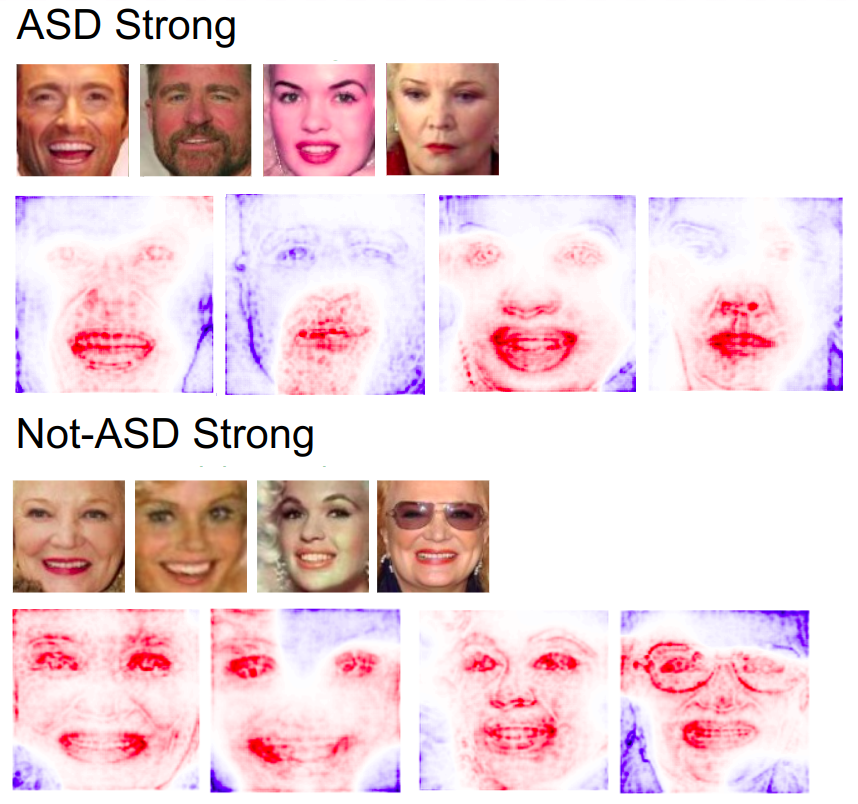

# Facial Traits Rating Prediction Using Deep Model

This repository provides the code of Facial Traits Rating Prediction and Neural network Visualization mentioned in paper : Comprehensive social trait judgments from faces in autism spectrum disorder.

### Link: 
[[PDF]](https://europepmc.org/article/ppr/ppr537217)

# Introduction
* People often make trait judgments about unfamiliar others based on their faces in the absence of context or other information, such as forming an impression that someone looks friendly, trustworthy, or strong.

* Individuals with Autism Spectrum Disorder (ASD) often have difficulties reading social information from faces.
* In this work, we try to study how do the people with ASD make facial trait judgement by seeing face images.

# Data
Prepared 500 face images of 50 identities. 10 face images per identity.
Each image has different social trait ratings as label data.

# Methods
* Participants with ASD and Non-ASD are asked to check these face images and give their ratings on several social traits, like warm, critical, competent, practical, feminine, strong, youthful, charismatic, trustworthy, dominant, recognize, etc.

* Based on the face images and rating labels, we trained a series of vgg16-based regression model for ASD and Not-ASD participants of each social trait using transfer learning.

* After get pre-trained regression model, Layer-wise Relevance Propagation (LRP) technique is adopted to highlight which pixels of input face image the regression model used to support its output rating label.

[[paper]](https://arxiv.org/abs/1808.04260)
[[github]](https://github.com/albermax/innvestigate)

# Some result
* Some visualzation saliency maps of single face image for strong trait for ASD and Non-ASD participants.

* Average saliency map of 500 face images about warm and strong social traits.

# Content
This repository contains the implementation of:
* VGG16 based regression model 
* LRP Analysis

